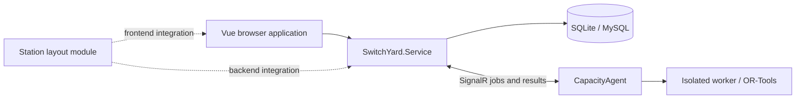

# SwitchYard

[中文](README.md)

SwitchYard is a toolkit for teaching railway yard and hub operations, preparing station plans, and running calculations. It includes hump profile design, rolling simulations, station capacity analysis, operation process editing, and course materials. This guide describes the current repository implementation; project files and lockfiles are the source of truth for dependency versions.

## Documentation

| Task | Guide |
| --- | --- |
| Learn the interface, accounts, languages, and course controls | [User guide (Chinese)](doc/User-Guide.md) |
| Configure and start the complete system locally | [Getting started (Chinese)](doc/Getting-Started.md) |
| Prepare layouts, routes, plans, and capacity calculations | [Capacity guide (Chinese)](doc/Capacity.md) |
| Edit activities, events, precedences, and anchors | [Operation processes (Chinese)](docs/operation-process.md) |
| Design a hump profile and run headway checks and simulations | [Hump guide (Chinese)](doc/Hump.md) |
| Connect an independent solver | [CapacityAgent](SwitchYard.WebApi/SwitchYard.CapacityAgent/README.md) |
| Develop the frontend and reuse UI components | [Frontend development (Chinese)](switchyard-vue/README.md) |
| Deploy the API and static frontend | [Deployment (Chinese)](doc/Deploy-Instruction.md) |
| Operate and back up a deployment | [Operations (Chinese)](doc/Operations-Recommendations.md) |
| Migrate SQLite data to MySQL | [Database migration (Chinese)](doc/SQLite-to-MySQL-Migration.md) |
| Embed the standalone station layout module | [Module overview](SwitchYard.StationLayout/README.md) / [Integration guide (Chinese)](SwitchYard.StationLayout/INTEGRATION_GUIDE.zh-CN.md) |

General guides live in `doc/`; the detailed process model and API guide is maintained in `docs/operation-process.md`.

## Current capabilities

| Module / route | Implemented features |
| --- | --- |
| Hump `/hump` | Instance management, plan view, wagon and calculation conditions, profile design, energy-height calculations, headway checks, 2D and 3D rolling simulations |
| Capacity `/capacity` | Station layouts, route design, 3D views, calculation parameters, operation processes, train templates, train operation plans, model solving, and simulation |
| Analysis within Operation Plan | Plan chart, occupation time tables, bottleneck analysis, and capacity category summaries |
| Courses `/courses` | Course navigation, study content, videos, PDF slides, and fill-in-the-blank exercises |
| Accounts | Registration and sign-in, profile and password changes, administrative user and hump-instance management, and instance authorization |
| Standalone station layout | Reusable Vue package, injected host gateway, shared document contracts, and backend services |

The separate **Result Analysis** tab in the capacity workspace is still a placeholder. Implemented analysis views are inside **Operation Plan**. The traction-calculation section contains a frontend sample rather than a connected production calculation. A 3D view displays station geometry and movements; it is not the capacity solver.

The interface supports Chinese and English. Capacity analysis, courses, and other updated workspaces use small circular buttons with hover labels and dividers for resizable panels. The hump module retains its original buttons, headings, toolbars, and panel styles; arrows expand or collapse the side panels in the profile designer. The independent station layout module retains its own toolbar design. Names, descriptions, and teaching content supplied by users are not automatically translated.

## Preview the interface

Frontend requirements: **Node.js 20.19+ within 20.x, or 22.12+**. Use **22.18+ or 24** for tests that load TypeScript directly. Keep the repository layout intact: the frontend depends on the sibling `SwitchYard.StationLayout/frontend` package.

From the repository root:

```powershell
cd switchyard-vue
npm ci
npm run dev -- --host 127.0.0.1
```

The development port is fixed at `5173`. Vite reports an error if it is occupied instead of silently choosing another port. These development pages use local fixtures and do not require a business database:

- [Workspace preview](http://127.0.0.1:5173/dev/workspace-style.html): production UI components with local sample data.
- [Interactive process example](http://127.0.0.1:5173/dev/operation-process.html): changes are stored only in the current page's memory.

The workspace preview accepts `?lang=en`, `?page=hump&lang=en`, and `?page=course&lang=en`. The process example accepts `?lang=en`. These pages are development entries and are not included in the production build.

## Run the complete system

The API targets **.NET 8**, while CapacityAgent targets **.NET 10**. The shared station module and its smoke tests target both. Use the **.NET 10 SDK** for a complete solution build, and ensure the **ASP.NET Core 8 runtime** is available to run the API and .NET 8 tests. See [Getting started](doc/Getting-Started.md) for environment checks, database setup, and required configuration.

1. Configure API bindings, JWT settings, and both business database sections using the getting-started guide.
2. From the repository root, with those settings in place:

   ```powershell
   dotnet run --project SwitchYard.WebApi/SwitchYard.Service --no-launch-profile
   ```

3. Start the frontend. In development, the default API follows the browser's hostname using HTTP port `7297`: `http://localhost:5173` connects to `http://localhost:7297`, and a LAN address connects to that same host on port `7297`. To select a different API, set an explicit override in `switchyard-vue/.env.development.local`:

   ```dotenv
   VITE_API_BASE_URL=http://localhost:7297
   ```

4. Prepare the required business template/account data and sign in. Schema initialization alone does not seed a working teaching dataset: user creation currently depends on default hump template `001`, so registration cannot complete against an empty database without that template.
5. For **Model Solving**, start and connect [CapacityAgent](SwitchYard.WebApi/SwitchYard.CapacityAgent/README.md), then select an available agent and model in the web interface.

The API explicitly calls `UseUrls` with `WebApi:Hosts`. Do not infer its actual port from `launchSettings.json` alone; check the startup log. Development defaults bind to `http://0.0.0.0:7297` and retain `http://localhost:5102` for compatibility. This keeps the original primary port `7297` after a restart or network change without requiring a fixed network-adapter IP. Open the service through `localhost` or the machine's actual address.

`VITE_API_BASE_URL` is read at development-server startup or build time. Restart Vite or rebuild after changing it. Use the API root URL, without appending `/api`: authentication uses `/api/Auth/...`, while business routes include `/Hump/...`, `/StationLayout/...`, and `/OperationPlan/...`.

## Architecture and directories



| Directory | Purpose |
| --- | --- |
| `switchyard-vue/` | Vue 3, TypeScript, Vite, Element Plus, Pinia, vue-i18n, and Three.js frontend |
| `SwitchYard.WebApi/SwitchYard.Service/` | ASP.NET Core 8 API, authentication, authorization, Dapper database access, and agent coordination |
| `SwitchYard.WebApi/SwitchYard.Hump/` | Hump calculation library |
| `SwitchYard.WebApi/SwitchYard.Capacity/` | Capacity models and shared contracts |
| `SwitchYard.WebApi/SwitchYard.CapacityAgent/` | Independent .NET 10 agent and OR-Tools workers |
| `SwitchYard.StationLayout/frontend/`, `backend/` | Reusable station layout module; the host supplies persistence and authorization |
| `SwitchYard.WebApi/*Tests/` | Backend smoke and integration tests |
| `switchyard-vue/tests/`, `checks/`, `dev/` | Frontend tests and development fixtures |
| `scripts/deploy/` | systemd unit, environment template, and installation script |
| `LocalData/` | Local databases and development data, excluded from version control |

Authentication uses JWT access tokens and refresh tokens. The frontend sends a SHA-256 password value; the backend stores an Argon2 password hash. See the account and deployment guides for actual session and permission behavior.

## Build and verify

Run in `switchyard-vue`:

```powershell
npm run type-check
node node_modules/vite/bin/vite.js build --mode production
npm run preview -- --host 127.0.0.1
```

The output is `switchyard-vue/dist`; the preview port defaults to `4173`. Set the deployment API address before building. Running type checking and Vite separately also avoids argument-forwarding issues in some Windows/npm versions.

Relevant UI, simulation, and process regressions:

```powershell
node --test --test-isolation=none tests/paneDivider.test.mjs tests/simulationPerformance.test.mjs tests/simulationViewport.test.mjs tests/threePageLifecycle.test.mjs checks/operationProcess.test.mjs
```

See [frontend verification](switchyard-vue/tests/README.md) for further tests and visual fixtures. With the .NET 10 SDK, build the backend solution from the repository root:

```powershell
dotnet build SwitchYard.WebApi/SwitchYard.Service.sln
```

The [operation process integration tests](SwitchYard.WebApi/SwitchYard.OperationProcess.Tests/README.md) use a temporary SQLite database and test-only authentication.

## Troubleshooting

| Symptom | Check |
| --- | --- |
| UI loads but business data does not | API status, configured root URL, Vite restart, login, and instance permissions |
| No available solver | Agent connection to the same API, account activation/password status, access rules, model version, and free slots |
| Empty layout or simulation | Selected instance/scheme/plan and saved geometry, routes, and operation data |
| Empty course materials | Server resource directory, manifest responses, and file permissions |
| Refreshing a frontend route returns 404 | History-mode fallback to `index.html` in the static server |
| Built frontend still calls an old API | Rebuild after changing the API URL; it is embedded in the bundle |

## Maintenance and license

Maintained by the Railway Yards and Hubs course team, School of Traffic and Transportation, Beijing Jiaotong University, including Liao Zhengwen.

Repository: [Gitee / SwitchYard](https://gitee.com/lzw37/SwitchYard). Licensed under the [MIT License](LICENSE). Update the relevant usage guide, English overview, and verification instructions when changing behavior.
