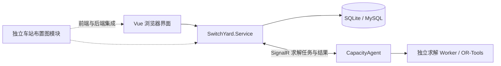

# SwitchYard

[English](README.en.md)

SwitchYard 是面向铁路站场与枢纽教学、方案编制和计算分析的工具集，包含驼峰设计与溜放仿真、车站通过能力分析、作业过程编排以及课程学习资源。本文与仓库当前实现对应；具体依赖版本以项目文件和锁文件为准。

## 文档入口

| 需要做什么 | 阅读文档 |
| --- | --- |
| 了解按钮、语言切换、分栏、账号和课程操作 | [使用指南](doc/User-Guide.md) |
| 在本机配置并启动前后端 | [本地开发与首次启动](doc/Getting-Started.md) |
| 编制站场、进路、作业计划并分析能力 | [能力分析使用说明](doc/Capacity.md) |
| 编排活动、事件、次序和锚，生成列车计划 | [作业过程编排](docs/operation-process.md) |
| 设计驼峰纵断面、检验间隔并播放仿真 | [驼峰使用说明](doc/Hump.md) |
| 运行独立求解代理 | [CapacityAgent 说明](SwitchYard.WebApi/SwitchYard.CapacityAgent/README.md) |
| 开发前端、复用圆按钮和拖动条 | [前端开发说明](switchyard-vue/README.md) |
| 部署 Web 服务和静态前端 | [部署说明](doc/Deploy-Instruction.md) |
| 检查日志、备份和运行状态 | [运维说明](doc/Operations-Recommendations.md) |
| 检查删除范围、关联引用和结果失效规则 | [删除与关联数据维护](docs/deletion-lifecycle.md) |
| 将 SQLite 数据迁移到 MySQL | [数据库迁移说明](doc/SQLite-to-MySQL-Migration.md) |
| 在其他程序中接入独立车站布置图 | [独立控件接入指南](SwitchYard.StationLayout/INTEGRATION_GUIDE.zh-CN.md) |

`doc/` 保存通用和业务说明，`docs/operation-process.md` 保存作业过程的详细约束与接口说明。文档互相链接，无需按目录顺序阅读。

## 当前功能

| 模块 / 入口 | 当前提供的功能 |
| --- | --- |
| 驼峰 `/hump` | 实例管理、平面布置、车辆及计算条件、纵断面方案、能量高度计算、间隔检验、二维和三维溜放仿真 |
| 通过能力 `/capacity` | 车站布置图、进路设计、三维查看、计算参数、作业过程与列车模板、列车作业计划、模型求解、二维/三维显示 |
| 作业计划内的分析页签 | 计划图、作业占用时间表、瓶颈分析、能力分类汇总 |
| 课程 `/courses` | 按课程目录浏览学习内容、视频、PDF 课件和填空练习 |
| 账号与权限 | 注册与登录、个人信息、密码修改、管理员用户管理和驼峰实例管理、业务实例权限校验 |
| 独立车站布置图模块 | 可复用 Vue 控件、宿主注入网关、站场文档与后端服务契约 |

通过能力主导航中的独立「结果分析」页签目前仍为占位页；已实现的分析功能位于「作业计划」内。「牵引计算」区域目前为前端样例，尚未接入正式计算。三维页面用于查看站场和播放计划，不能代替能力求解；播放结果取决于当前方案、进路和作业数据。

界面提供中英文切换。能力分析、课程等功能区采用小圆形按钮，悬停可查看名称；支持调整的侧栏和底栏使用可拖动分隔条。驼峰模块保留原有按钮、标题、工具栏和面板样式，纵断面两侧面板可通过箭头展开或收起。独立车站布置图控件保留自身的工具栏设计。用户输入的名称、说明和课程内容不会随界面语言自动翻译。

## 先查看界面

需要 Node.js **20.19+（20.x）或 22.12+**；运行仓库内直接加载 TypeScript 的 Node 测试时使用 **22.18+ 或 24**。请保留整个仓库的相对目录结构，前端依赖旁边的 `SwitchYard.StationLayout/frontend`。

在仓库根目录打开终端：

```powershell
cd switchyard-vue
npm ci
npm run dev -- --host 127.0.0.1
```

开发端口固定为 `5173`；端口被占用时会明确报错，不会自动切换到其他端口。可打开以下本地示例，无需配置业务数据库：

- [工作区样式预览](http://127.0.0.1:5173/dev/workspace-style.html)：使用生产组件和本地示例数据。
- [作业过程交互示例](http://127.0.0.1:5173/dev/operation-process.html)：示例修改只在当前页面内存中保存。

工作区预览支持 `?page=hump&lang=en` 和 `?page=course&lang=en`；过程示例支持 `?lang=en`。这些开发入口不包含在正式构建中，也不代表后端业务验证。

## 启动完整系统

API 的目标框架为 **.NET 8**，CapacityAgent 为 **.NET 10**，独立站场模块及其烟雾测试同时面向两者。完整构建建议准备 **.NET 10 SDK**，运行 API 和 .NET 8 测试还需 **ASP.NET Core 8 运行时**。此外需要配置好的 SQLite 或 MySQL 数据库和前端；能力求解另需运行 CapacityAgent。

1. 按[首次启动说明](doc/Getting-Started.md)配置后端监听地址、JWT、数据库及所需表结构。
2. 从仓库根目录启动 API：

   ```powershell
   dotnet run --project SwitchYard.WebApi/SwitchYard.Service --no-launch-profile
   ```

3. 启动前端。开发环境默认跟随浏览器地址中的主机名，通过 HTTP `7297` 访问 API；例如打开 `http://localhost:5173` 时请求 `http://localhost:7297`，通过局域网地址打开时请求同一主机的 `7297`。如需连接其他 API，可在 `switchyard-vue/.env.development.local` 中显式覆盖：

   ```dotenv
   VITE_API_BASE_URL=http://localhost:7297
   ```

4. 准备好业务模板和账号后，注册或使用已有账号登录，创建或选择有权限的实例。首次建表不会自动提供完整的教学数据：当前新建用户流程依赖默认驼峰模板 `001`，空库缺少该模板时不能直接完成注册；详见首次启动说明。新实例的数据需要逐步录入。
5. 要使用「模型求解」，按[代理说明](SwitchYard.WebApi/SwitchYard.CapacityAgent/README.md)启动并连接代理，再选择可用模型。

API 的实际监听地址来自 `WebApi:Hosts`，程序会显式调用 `UseUrls`；不能只根据 `launchSettings.json` 或 `--launch-profile` 判断端口。开发配置默认监听 `http://0.0.0.0:7297`，保留 `http://localhost:5102` 作为兼容入口。无需绑定某个固定网卡 IP，换网络或重启后仍使用原主端口 `7297`；浏览器请使用 `localhost` 或本机实际地址访问。以启动日志中的监听地址为准。

前端 `VITE_API_BASE_URL` 是启动/构建时配置。修改后需重启开发服务或重新构建。接口路径并非统一带 `/api`：认证使用 `/api/Auth/...`，业务模块使用 `/Hump/...`、`/StationLayout/...`、`/OperationPlan/...` 等，因此这里应填写服务根地址。

## 架构与目录



| 目录 | 职责 |
| --- | --- |
| `switchyard-vue/` | Vue 3、TypeScript、Vite、Element Plus、Pinia、vue-i18n 和 Three.js 前端 |
| `SwitchYard.WebApi/SwitchYard.Service/` | ASP.NET Core 8 API、认证授权、Dapper 数据访问、SignalR 代理协调 |
| `SwitchYard.WebApi/SwitchYard.Hump/` | 驼峰计算核心库 |
| `SwitchYard.WebApi/SwitchYard.Capacity/` | 能力分析业务模型与共享契约 |
| `SwitchYard.WebApi/SwitchYard.CapacityAgent/` | 独立计算代理和 OR-Tools 求解 Worker |
| `SwitchYard.StationLayout/frontend/`、`backend/` | 独立站场图模块；数据库连接和授权由宿主提供 |
| `SwitchYard.WebApi/*Tests/` | 后端烟雾、集成与作业过程回归测试 |
| `switchyard-vue/tests/`、`checks/`、`dev/` | 前端测试和开发预览 |
| `scripts/deploy/` | systemd 服务、环境变量模板和安装脚本 |
| `LocalData/` | 本地数据库与开发数据，不纳入版本控制 |

认证采用 JWT 访问令牌和刷新令牌；前端发送 SHA-256 处理后的密码，服务端使用 Argon2 保存密码验证数据。具体权限和会话行为见[使用指南](doc/User-Guide.md)，部署配置见[部署说明](doc/Deploy-Instruction.md)。

## 构建与验证

前端在 `switchyard-vue` 目录执行：

```powershell
npm run type-check
node node_modules/vite/bin/vite.js build --mode production
npm run preview -- --host 127.0.0.1
```

正式构建写入 `switchyard-vue/dist`；预览默认端口为 `4173`。需要指定部署用 API 地址时，在构建前设置 `VITE_API_BASE_URL`。上面将类型检查与 Vite 构建分开，避免部分 Windows/npm 环境下组合脚本的参数转发问题。

界面分隔条、仿真和作业过程相关回归：

```powershell
node --test --test-isolation=none tests/paneDivider.test.mjs tests/simulationPerformance.test.mjs tests/simulationViewport.test.mjs tests/threePageLifecycle.test.mjs checks/operationProcess.test.mjs
```

更多测试和视觉预览见[前端验证说明](switchyard-vue/tests/README.md)。安装 .NET 10 SDK 后，后端从仓库根目录构建：

```powershell
dotnet build SwitchYard.WebApi/SwitchYard.Service.sln
```

后端作业过程测试使用临时 SQLite 和独立测试身份，具体运行方式见[接口集成测试说明](SwitchYard.WebApi/SwitchYard.OperationProcess.Tests/README.md)。

## 常见问题

| 现象 | 先检查 |
| --- | --- |
| 页面能打开但业务列表加载失败 | API 是否运行、`VITE_API_BASE_URL` 是否对应监听地址、是否已重启开发服务、登录和实例权限 |
| 看不到可用计算代理 | Agent 是否连接同一 API，账号是否已激活和完成改密，代理权限、模型版本和可用槽位 |
| 站场或仿真为空 | 是否选择实例/方案/计划，是否有已保存布局、进路和可播放的作业数据 |
| 课程目录或课件为空 | 后端课程资源根目录、清单接口和文件读取权限，见首次启动与部署说明 |
| 前端路由刷新后 404 | 静态服务器是否将 History 路由回退到 `index.html` |
| 修改配置后预览仍连旧服务 | 生产地址在构建时写入产物；修改配置后重新构建 |

## 维护与许可证

项目维护者：北京交通大学交通运输学院「铁路站场与枢纽」课程组，廖正文等。

项目地址：[Gitee / SwitchYard](https://gitee.com/lzw37/SwitchYard)。本仓库采用 [MIT License](LICENSE)。提交功能修改时，请同步对应使用说明、英文入口和相关验证方式。
