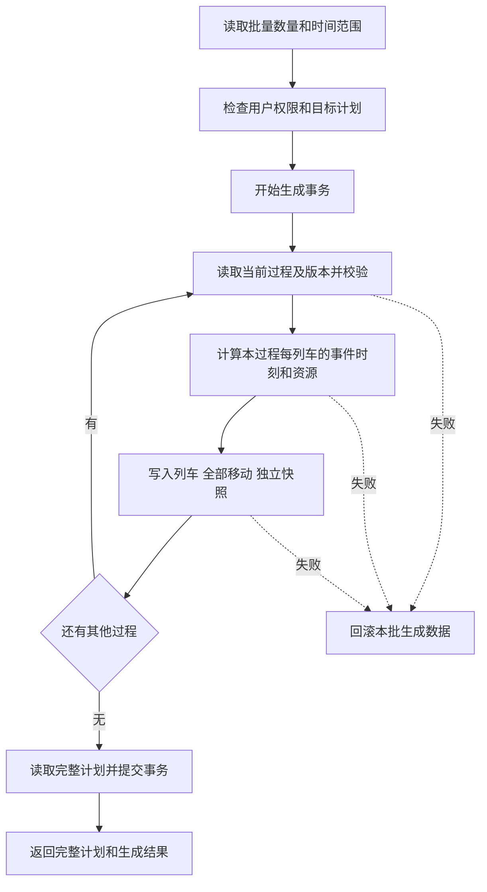

# 从作业过程生成实现审阅报告

本报告面向功能审阅，依据 2026 年 10 月 2 日当前工作区代码，重点说明如何从已保存的作业过程，批量生成目标作业计划中的列车、移动和过程约束。报告也涵盖同名的列车模板生成入口，以及取消方块拖动限制后的实际行为。

当前实现支持一次为多个作业过程指定列车数量，在一个事务中追加全部列车。每列车独立保留完整过程快照，并在生成阶段得到满足自身时间和资源衔接约束的初始排布。跨列车占用冲突由后续能力求解处理。审阅时最需要明确的是：多个过程分别排布，手工修改移动也不会同步重写原过程快照。

## 两个同名入口的用途

| 入口位置 | 生成内容 | 数据归属 | 约束保留方式 |
| --- | --- | --- | --- |
| 列车模板中的从作业过程生成 | 一个列车模板及每个活动对应的移动模板 | 当前实例和站场方案的共享模板库 | 转换名称、备选进路、最小持续时间和稳定顺序；完整约束留在源过程 |
| 列车作业计划中的从作业过程生成 | 用户指定数量的实际列车、每列车全部移动及独立过程快照 | 当前选中的作业计划 | 每列车复制完整活动、事件、次序、锚和进路锚配置 |

实际计划生成直接读取作业过程，不要求先生成列车模板。生成的实际列车和移动的 `TrainTemplateID` 均为空。再次执行会继续追加列车，保留计划中已有列车。

列车模板入口调用 `POST /OperationPlan/GenerateTrainTemplateFromProcess`。每个活动转换为一条移动模板，最小时长从分钟向上取整为秒；停留活动尝试匹配已有的、只对应一条备选股道的停留进路。缺少停留进路时仍生成模板行，并返回警告。最大时长、事件时刻、次序间隔和并行关系等不能完整写入旧模板字段。

依据：[实际计划生成接口](D:/SwitchYard/SwitchYard.WebApi/SwitchYard.Service/Controllers/OperationPlanFromProcessController.cs:14)、[列车模板生成接口](D:/SwitchYard/SwitchYard.WebApi/SwitchYard.Service/Controllers/OperationPlanProcessGenerationController.cs:12)、[模板字段转换](D:/SwitchYard/SwitchYard.WebApi/SwitchYard.Service/Services/OperationProcessTrainTemplateGenerator.cs:13)。

## 作业过程的数据模型

源过程保存在 `operationprocesstemplate` 表，内容为 JSON 文档，并附有 `Revision` 版本号。模板库按 `InstanceID + StationSchemeID` 共享，数据库中的 `OperationPlanID` 使用空字符串。目标作业计划单独保存实际列车。

| 对象 | 主要内容 | 在生成中的用途 |
| --- | --- | --- |
| 活动 `activities` | 类型、最小和最大时长、起止事件、备选进路或股道 | 生成实际移动，并限定时长及资源候选 |
| 事件 `events` | 可空的相对时刻、节点、备选节点、锚 | 决定活动端点的时刻和物理地点 |
| 次序 `precedences` | 前序事件、后序事件、最小间隔 | 建立事件之间的时间依赖 |
| 锚 `anchors` | 对现有 Link 的引用 | 限定事件可发生的股道位置 |
| 进路锚 `routeAnchors` | 进路起点锚和终点锚 | 限定具体进路端点的衔接位置 |

活动支持接车、发车、调车、机车走行和停留五类。前四类使用 `RouteList`，停留使用 `TrackList`。当前 `Track` 对应站场中现有的 `Link`，停留候选必须有非空名称。

过程中的时长、事件相对时刻和次序间隔以**分钟**为单位；排布算法和快照中的实际事件时刻以**秒**为单位。旧移动表的 `MinDuration` 是整数秒，因此写入时向上取整；完整快照和后续过程求解仍保留小数秒精度。例如，0.001 分钟在快照中对应 0.06 秒，而旧移动字段的最小时长写为 1 秒。

依据：[对象模型和时间单位](D:/SwitchYard/SwitchYard.WebApi/SwitchYard.Service/Models/OperationProcessModels.cs:15)、[共享模板范围](D:/SwitchYard/SwitchYard.WebApi/SwitchYard.Service/Controllers/OperationProcessController.cs:21)、[分钟转换为旧移动整数秒](D:/SwitchYard/SwitchYard.WebApi/SwitchYard.Service/Controllers/OperationPlanFromProcessController.cs:174)。

## 前端批量输入和请求

用户选择目标作业计划后，点击从作业过程生成。前端从当前站场方案读取全部已保存过程，显示名称、说明、版本、活动数和列车数量。未保存的编辑草稿不参与生成。

每行数量初始为 0，表示跳过该过程；数量为正的行参与本次请求。每行允许 0 至 1000 的整数，所有行的列车总数量必须为 1 至 1000。重新加载列表时，仍存在的过程保留已输入数量，并使用重新读取的版本号；重新打开对话框则清空数量。所有过程共用开始、结束时间。

示例请求如下。其中过程 A 生成 2 列，过程 B 生成 3 列；数量为 0 的行不发送。

```json
{
  "instanceID": "instance",
  "stationSchemeID": "scheme",
  "operationPlanID": "plan",
  "processes": [
    { "processTemplateID": "process-a", "revision": 3, "trainCount": 2 },
    { "processTemplateID": "process-b", "revision": 1, "trainCount": 3 }
  ],
  "startTime": "08:00",
  "endTime": "09:00"
}
```

前端在生成期间阻止重复点击和相关编辑。返回结果通过当前请求版本及实例、方案、计划三项范围检查后才应用，避免切换页面后把旧请求结果写入新范围。成功响应包含完整当前计划，前端直接替换本地列表，并选中第一列新生成列车。

后端同时兼容旧客户端的单过程请求：当 `Processes` 为 null 时，从顶层的 `ProcessTemplateID + Revision + TrainCount` 构造一项选择；显式传入空数组则不回退，按总数量无效处理。

依据：[数量表格](D:/SwitchYard/switchyard-vue/src/capacity/OperationPlan.vue:258)、[数量与请求项构造](D:/SwitchYard/switchyard-vue/src/capacity/processPlanBatch.ts:6)、[加载和提交流程](D:/SwitchYard/switchyard-vue/src/capacity/OperationPlan.vue:6380)、[请求模型](D:/SwitchYard/SwitchYard.WebApi/SwitchYard.Service/Models/TrainProcessSnapshot.cs:17)。

## 后端生成和事务边界

主接口为 `POST /OperationPlan/GenerateTrainOperationPlanFromProcess`，处理流程如下。



权限检查要求用户为实例所有者或管理员，并确认站场方案和目标作业计划存在。模板读取、校验和生成写入都按当前实例及方案限定，避免跨方案引用。

正式生成事务开始前，接口准备数据库结构，并执行旧模板向方案共享库的迁移。**迁移和本批生成是不同事务边界**：后续生成失败会撤销本批列车、移动和快照，已经完成的模板迁移不会因此撤销。

事务内逐个处理数量为正的过程：从数据库读取指定版本，检查图结构、资源引用、时长与次序，再进行排布；写完该过程后再次检查源版本。MySQL 读取源记录时使用 `FOR UPDATE`，同时保留 `revision` 检查。一个过程出错会回滚此前在同一批次中已写入的其他过程结果。

数据库插入列车、移动和快照时，均要求恰好写入一行。正常结束前，接口读取完整计划，附加 `GeneratedTrainIDs` 和 `Warnings`，提交事务后返回。典型响应为：参数或不可行排布返回 400，范围或模板不存在返回 404，源版本变化返回 409，非所有者且非管理员返回 403，数据库异常返回 500。

依据：[主接口及事务](D:/SwitchYard/SwitchYard.WebApi/SwitchYard.Service/Controllers/OperationPlanFromProcessController.cs:14)、[权限检查](D:/SwitchYard/SwitchYard.WebApi/SwitchYard.Service/Controllers/OperationPlanProcessGenerationController.cs:88)、[模板读取和行锁](D:/SwitchYard/SwitchYard.WebApi/SwitchYard.Service/Controllers/OperationProcessController.cs:197)、[模板迁移](D:/SwitchYard/SwitchYard.WebApi/SwitchYard.Service/Services/SchemeTemplateStore.cs:17)。

## 初始时间排布算法

### 为每列车定位基准时刻

排布器 `OperationProcessPlanScheduler.Build` 每次处理**一个作业过程**及其列车数量。活动先按事件依赖拓扑排序，起点排名相同时保留原活动数组顺序；画布坐标不参与排布。此排序用于列表顺序和基准定位，并不要求相邻活动在时间上连续。

设本过程活动数为 `A`、列车数为 `N`，时间范围为 `[S, E]` 秒，活动中最大的最小时长为 `D` 秒。代码使用以下定位公式：

```text
available = max(0, E - S - ceil(D / 60) × 60)
slot = N × A > 1 时 available / 60 / (N × A - 1)，否则为 0
第 i 列车的目标基准 = S + round(i × A × slot) × 60
i 从 0 开始
```

目标基准按整分钟定位，随后被限制到事件图允许的基准区间。如果目标与固定事件、持续时间或时间窗口冲突，会移到最近的可行基准；整个图不可行时，拒绝生成。

示例：假设一个过程包含接车 2 分钟、停留 8 分钟、发车 1 分钟，均取固定时长，以零间隔依次衔接，且资源衔接可行。在 08:00 至 09:00 生成 2 列，`available = 52` 分钟，`slot = 52 / 5 = 10.4` 分钟，两列目标基准分别为 08:00 和 08:31。

| 列车 | 接车 | 停留 | 发车 |
| --- | --- | --- | --- |
| 第 1 列 | 08:00 至 08:02 | 08:02 至 08:10 | 08:10 至 08:11 |
| 第 2 列 | 08:31 至 08:33 | 08:33 至 08:41 | 08:41 至 08:42 |

这个定位公式沿用旧生成逻辑的时间槽。它只为列车基准提供目标；单列车内部的活动时刻由完整约束图确定。

### 在约束图上计算最早事件时刻

代码用差分约束图统一表达以下条件，图中一条边表示 `t_to - t_from ≤ bound`。

| 业务条件 | 时间关系 |
| --- | --- |
| 排布范围 | 每个事件及列车基准都位于 `[S, E]` |
| 事件不早于基准 | `t_event ≥ origin` |
| 非空相对固定时刻 | `t_event = origin + 60 × event.time` |
| 活动持续时间 | `60 × minDuration ≤ t_end - t_start ≤ 60 × maxDuration` |
| 次序最小间隔 | `t_following - t_leading ≥ 60 × interval` |

基准固定后，排布器计算反向图到零点的最短距离，以其相反数取得各事件的最紧下界。这组下界构成同时可行的最早事件排布；最大时长和固定后序时刻也会反向影响前序事件。

因此，零间隔次序在其他约束允许时直接衔接，并行和孤立事件也会尽早发生。循环依赖在校验时被拒绝；其他时间矛盾由差分图检查拒绝。排完后，`ValidateSchedule` 再次逐项检查窗口、固定时刻、时长及间隔。

**批量中的每个过程分别使用同一个 `[S, E]`。** 上述公式中的 `N × A` 仅属于当前过程，并非所有过程的总活动数。两个过程的第一列都可能从 08:00 开始；生成阶段也不检查与计划中已有列车的占用冲突。

依据：[基准定位和事件图](D:/SwitchYard/SwitchYard.WebApi/SwitchYard.Service/Services/OperationProcessPlanScheduler.cs:26)、[稳定拓扑排序](D:/SwitchYard/SwitchYard.WebApi/SwitchYard.Service/Services/OperationProcessPlanScheduler.cs:153)、[差分图计算](D:/SwitchYard/SwitchYard.WebApi/SwitchYard.Service/Services/OperationProcessPlanScheduler.cs:263)、[排布结果校验](D:/SwitchYard/SwitchYard.WebApi/SwitchYard.Service/Services/OperationProcessPlanScheduler.cs:224)。

## 进路和停留股道的选择

排布器先从当前站场目录筛选候选。移动活动必须使用同类型进路，起终点要满足事件节点和锚约束；停留活动必须使用有名称的 Link，且股道满足两端事件地点和锚约束。旧数据中非空的 `SelectedRoute` 或 `SelectedTrack` 仍会限制候选。

默认资源选择按列车序号轮换，初始取 `候选[trainIndex % 候选数]`。共享同一个事件的活动还要通过回溯搜索，保证对应端点存在共同的节点和锚选择。共同位置不仅要求时间相同，也要求物理位置可以衔接；搜索失败即拒绝整批生成。

资源轮换仅用于选择初始进路或股道，没有按线路负荷、交叉冲突或最优间隔评价候选。代码限制每列车的共享事件资源组合尝试不超过 100000 次；单次 `Build` 的差分图总边松弛预算为 100000000 次，超过预算会提示减少数量或缩小候选。

实际计划生成停留活动时，选中股道写入快照的 `SelectedTrackIDs`，该移动的 `Route` 和 `RouteIDList` 保持为空。它不依赖进路设计页面中自动生成的停留进路。后续能力输入按 Link 与 Cell 的关联创建临时停留资源，该资源仅存在于求解输入中，不写入站场进路表；找不到关联轨道电路时无法求解。

依据：[候选筛选](D:/SwitchYard/SwitchYard.WebApi/SwitchYard.Service/Services/OperationProcessPlanScheduler.cs:174)、[资源轮换和共享事件搜索](D:/SwitchYard/SwitchYard.WebApi/SwitchYard.Service/Services/OperationProcessPlanScheduler.cs:94)、[共同物理位置](D:/SwitchYard/SwitchYard.WebApi/SwitchYard.Service/Services/OperationProcessResourceLocations.cs:10)、[求解内部停留资源](D:/SwitchYard/SwitchYard.WebApi/SwitchYard.Service/Services/StationCapacityProcessInputBuilder.cs:141)。

## 生成结果如何保存

每列车获得独立的服务端 ID 和连续递增的车次。车次从目标计划已有数字车次的最大值之后开始；列车名称来自过程名称，类型留空，固定作业关闭。每个活动生成一条移动，具有独立移动 ID。

| 保存位置 | 内容 |
| --- | --- |
| `train` | 目标计划中的列车身份、车次和名称 |
| `movement` | 活动名称、备选进路、整数秒最小时长、排定起止时刻、初始选中进路和排序 |
| `trainprocesssnapshot` | 来源模板及版本、完整过程副本、基准秒数、活动到移动映射、实际事件秒数及选中停留股道 |

快照以实例、方案、计划和列车四项作为联合主键，正文保存在 JSON `Document`。源模板以后修改或删除，不会改写这些独立副本。源模板和活动名称超过旧字段的 50 个 UTF-16 单元限制时，会按完整 Unicode 文本元素缩短显示名称并返回警告，完整名称仍在快照中。

`GetTrainOperationPlan` 返回普通列车、移动及 `ProcessConstraints` 快照。删除整列车会清理关联移动和快照；计划复制、改 ID、删除及旧自动生成入口重建也维护快照。共享模板库不随单个计划删除。复制或改 ID 后，读取快照时使用数据库行键修正执行归属。

依据：[写入列车及移动](D:/SwitchYard/SwitchYard.WebApi/SwitchYard.Service/Controllers/OperationPlanFromProcessController.cs:90)、[快照字段](D:/SwitchYard/SwitchYard.WebApi/SwitchYard.Service/Models/TrainProcessSnapshot.cs:4)、[快照持久化](D:/SwitchYard/SwitchYard.WebApi/SwitchYard.Service/Services/TrainProcessSnapshotStore.cs:13)、[计划读取快照](D:/SwitchYard/SwitchYard.WebApi/SwitchYard.Service/Controllers/OperationPlanController.cs:2539)。

## 与后续能力求解的衔接

能力输入构建器先读取普通移动，再应用过程快照。对于过程列车，它用快照恢复活动起止事件、原事件时刻、精确最小和最大时长、备选资源、次序和物理位置约束。包含过程快照的输入要求 CapacityAgent 模型版本至少为 `2.0.0`，服务端会检查代理版本。

计算代理为过程事件建立时间变量，把活动起止时刻绑定到对应事件，并施加固定事件、次序间隔、共享地点及资源占用冲突约束。普通列车仍使用旧的相邻移动连续规则，过程列车使用自身事件图。事件可移动范围受求解设置中的左移、右移容差限制，以快照原事件时刻为参考。

保存求解结果为饱和计划时，会校验完整事件时刻、活动映射和资源衔接，并将求解后的事件时刻、停留股道写入新计划快照。因此初始生成、能力求解、保存饱和计划是三个不同处理阶段。

依据：[过程输入恢复](D:/SwitchYard/SwitchYard.WebApi/SwitchYard.Service/Services/StationCapacityProcessInputBuilder.cs:13)、[代理版本检查](D:/SwitchYard/SwitchYard.WebApi/SwitchYard.Service/Services/CapacityAgentRegistry.cs:138)、[代理中的事件约束](D:/SwitchYard/SwitchYard.WebApi/SwitchYard.CapacityAgent/StationCapacityModel.cs:374)、[求解快照保存](D:/SwitchYard/SwitchYard.WebApi/SwitchYard.Service/Services/SaturatedOperationPlanService.cs:155)。

## 取消拖动限制后的当前行为

当前工作区已开放过程生成移动的拖动、左右边界调整及列表编辑，`EditMovement` 也允许保存这些修改。保存方块拖动时，前端更新所选 Cell 的 `CellOccupationOverridesJson`，不会同时修改整条移动的起止字段，也不会修改其他 Cell、列车或共享进路时间参数。

```text
startOccupationShift = round((方块新起点分钟 - 移动起点分钟) × 60)
endOccupationShift   = round((方块新终点分钟 - 移动终点分钟) × 60)
```

图中各 Cell 方块依照“移动起止时刻 + 该 Cell 偏移”绘制。保存失败会恢复拖动前的移动数据。拖动入口仍保留草稿、忙碌状态及鼠标按键检查。

这里存在需要审阅的两层数据关系：

| 用户操作 | 修改的数据 | 对完整过程快照的影响 |
| --- | --- | --- |
| 拖动或调整一个 Cell 方块 | 当前移动的该 Cell 占用偏移 | 不更新 `EventTimes` 或过程约束 |
| 在列表中编辑移动起止时间、时长和进路 | `movement` 的对应字段 | 不更新事件时刻、时长边界或资源候选 |
| 修改源作业过程 | 共享模板的新版本 | 不更新已生成列车快照 |
| 能力求解后保存饱和计划 | 新计划的移动和快照 | 新快照使用求解后的事件时刻及停留股道 |

**代码事实：** 下一次能力输入构建时，过程快照会覆盖手工编辑后的移动参考起止时间、时长范围及候选资源；Cell 占用偏移则保留，并仅在求解选中的 Route 和 Cell 匹配时生效。“过程约束”抽屉中的实际事件时刻也仍读取快照，而非拖动后的方块时间。

**审阅建议：** 明确手工编辑的业务含义。如果要求“以当前图形作为下一次求解基准”，还需要设计快照同步或覆盖规则，当前取消拖动限制尚未实现这项语义。若将方块调整理解为占用提前、延后，而过程事件约束保持原定义，则现有两层数据可以分别保留，但界面应清楚表达二者含义。

当前前后端仍限制过程列车单独新增、删除移动及调整移动顺序。允许编辑现有移动，并不等同于解除所有结构限制。

依据：[图表拖动](D:/SwitchYard/switchyard-vue/src/capacity/OperationPlan.vue:4899)、[拖动保存](D:/SwitchYard/switchyard-vue/src/capacity/OperationPlan.vue:4987)、[后端编辑](D:/SwitchYard/SwitchYard.WebApi/SwitchYard.Service/Controllers/OperationPlanController.cs:1199)、[快照覆盖移动输入](D:/SwitchYard/SwitchYard.WebApi/SwitchYard.Service/Services/StationCapacityProcessInputBuilder.cs:65)、[占用偏移参与求解](D:/SwitchYard/SwitchYard.WebApi/SwitchYard.CapacityAgent/StationCapacityModel.cs:475)、[抽屉读取事件快照](D:/SwitchYard/switchyard-vue/src/capacity/OperationPlan.vue:318)。

## 实现边界和审阅事项

| 事项 | 当前代码行为 | 建议审阅的问题 |
| --- | --- | --- |
| 数量与时间上限 | 每过程 0 至 1000 列，整批 1 至 1000 列；整批最多 20000 个活动；结束时刻最多为起算后的第 7 天 | 是否符合实际规模要求 |
| 跨日范围 | 结束不晚于开始时，自动增加完整天数，直到结束晚于开始；相同起止时间代表跨到下一天 | 是否符合用户对相同起止时间的理解 |
| 多过程时间分布 | 每个过程单独沿相同时间范围定位列车 | 是否需要将全部过程的列车统一分布 |
| 占用冲突 | 生成时未检查新列车之间或与已有列车的冲突 | 初始排布是否可以接受，还是需要生成后自动求解 |
| 手工编辑与快照 | 编辑移动及 Cell 偏移，快照仍保留原事件图和排定时刻 | 后续求解应参考原快照还是当前图形 |
| 停留方块显示 | 实际停留移动的 Route 为空；作业计划图的方块构建遇到空进路直接跳过 | 是否要求停留活动独立显示为可编辑方块 |
| 重复提交 | 前端阻止进行中的重复点击；接口没有批次幂等键，重新提交会追加新列车 | 响应丢失后重试，是否应识别已成功的同一批次 |

停留显示问题来自当前 Gantt 方块构建逻辑，不表示停留活动没有保存或没有参与过程能力求解。它也不会因为站场中新增了同名停留进路而自动建立移动关联。依据：[作业计划图方块构建](D:/SwitchYard/switchyard-vue/src/capacity/OperationPlan.vue:2727)。

重复提交的结论是对接口流程的代码推断：请求没有批次标识，每次成功都重新生成列车 ID。若服务端已提交但客户端未收到响应，再次发送相同请求可能产生另一批列车。当前版本检查用于防止使用过期源过程，不用于消除重复生成。

## 验证范围

本次审阅重新运行了以下既有测试，未修改生成实现。

| 验证 | 结果 | 说明 |
| --- | --- | --- |
| `processPlanBatch.test.mjs` | 4 项通过 | 所有过程列出、刷新保留数量、跳过零数量及总数量校验 |
| `operationPlanChart.test.mjs` | 6 项通过 | 过程方块移动和两侧调整、失败恢复、普通拖动检查、列表编辑 |
| 作业过程 HTTP 和 SQLite 集成测试 | 1813 项断言通过 | 整个测试程序的断言总数，含批量生成、事件排布、版本及事务、快照生命周期、手工偏移等回归 |

后端测试通过上轮按当前实现编译的测试程序执行，使用随机本机 HTTP 端口、临时 SQLite 和测试身份验证。本次未启用 `SWITCHYARD_PROCESS_TEST_WORKER`，因此没有实际启动 CapacityAgent 求解器；真实 Worker 的求解及饱和计划回归属于可选测试。MySQL 分支经过代码审阅，本次未连接 MySQL 执行。

相关测试：[批量输入测试](D:/SwitchYard/switchyard-vue/checks/processPlanBatch.test.mjs:1)、[图表交互测试](D:/SwitchYard/switchyard-vue/checks/operationPlanChart.test.mjs:1)、[实际过程生成集成测试](D:/SwitchYard/SwitchYard.WebApi/SwitchYard.OperationProcess.Tests/Program.cs:1192)、[最早事件测试](D:/SwitchYard/SwitchYard.WebApi/SwitchYard.OperationProcess.Tests/Program.cs:1389)、[多过程批量测试](D:/SwitchYard/SwitchYard.WebApi/SwitchYard.OperationProcess.Tests/Program.cs:1443)。

建议优先审阅“多过程是否统一分布”“手工调整后的求解基准”“停留活动是否独立显示”三项。这三项决定生成结果及后续调整是否符合预期业务语义。
